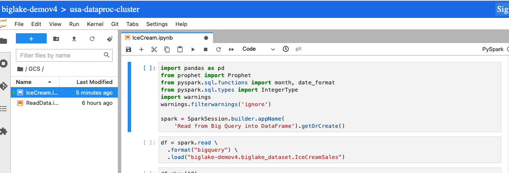
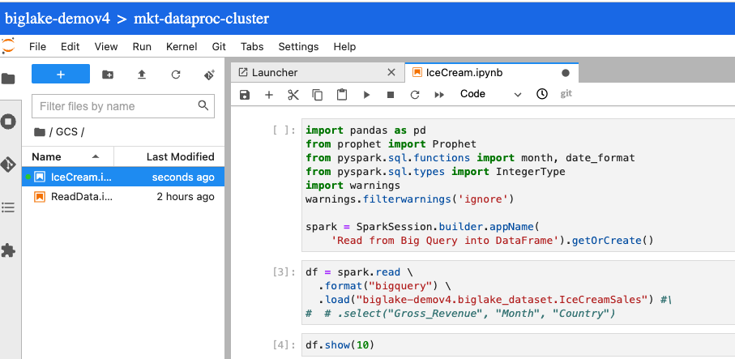
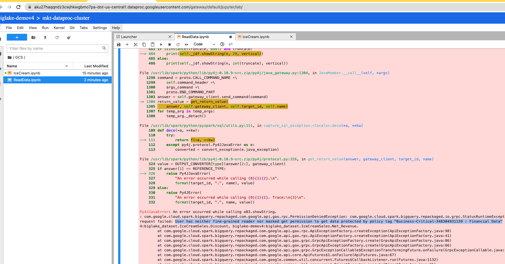

# About<br>
This module covers the foundational setup required for the BigLake Fine Grained Permissions Demo.


## 0. Prerequisites 

### 1. Create a project".<br>
Note the project number and project ID. <br>
We will need this for the rest fo the lab.<br>
### 2. Grant yourself security admin role<br>
This is needed for the networking setup.<br>
Go to Cloud IAM and through the UI, grant yourself security admin role.
### 3. Grant yourself Organization Policy Administrator at an Organization level<br>
This is needed to set project level policies<br>
In the UI, set context to organization level (instead of project)<br>
Go to Cloud IAM and through the UI, grant yourself Organization Policy Administrator at an Organization level.<br>
Don't forget to set the project back to the project you created in Step 1 above in the UI.
### 4. Create 3 user accounts<br>
Go To admin.google.com...<br>
* Click on 'Add a user'<br>
* And add a user as shown below:<br><br>
 

<br>
- You will add three users: <br>
1. One user with access to all USA records in the dataset <br>
2. One user with access to all Australia records in the dataset<br>
3. One marketing user with access to both USA and Australia recoreds but restricted to certain columns<br>
<br>
- While you can use any usernames you want, we recommend you use the following as we have tested with these: <br>
1. usa_user <br>
2. aus_user <br>
3. mkt_user <br>

<br> <br>
### 5. Create Separate Chrome Profiles for 1 or More of the User Accounts
To make it easier to demo the three different personas (users) we recommend you set up 3 profiles in your browser<br>
<br>
- To add a profile<br>
* click on your profile picture at the far right of the screen next to the vertical 3 dots. <br>
* Then click on '+ Add' at the bottom of the screen as shown below: <br>
 
<br>

We recommend you setup three profiles: <br>
#1. One for the USA User
#2. One for the Australia User
#3. And one for the Marketing User


For more information see these instructions --> [Add Profile Instructions](https://support.google.com/chrome/answer/2364824?hl=en)

### Steps in the lab:
<br><br>


## 1. Details about the environment that is setup by this module

### 1.1. Products/services used in the lab
The following services and resources will be created via Terraform scripts:
<br><br>
#1. VPC, Subnetwork and NAT rules
#2. IAM Groups for USA and Australia
#3. Dataplex Policy for Column level Access
#4. BigQuery Dataset, Table and Row Level Policies
#5. Three Dataproc 'Personal' Clusters: 1 for USA, Australia and Marketing Users
#6. Preconfigured Jupyter Notebooks


### 1.2. Tooling

1. Terraform for automation
2. Cloud Shell for executing Terraform

<hr>

## 2. Provision the GCP environment 

### 2.1. Create a Cloud Shell Session
<br><br>

### 2.2. Clone the workshop git repo

```
cd ~
git clone https://github.com/j-f-oleary-bigdata/biglake-finegrained-demo
```

### 2.3. About the Terraform script

#### 2.3.1. Navigate to the Terraform directory
```
cd ~/biglake-finegrained-demo/
```


#### 2.3.2. What we will do next

1. Define variables for use by the Terraform
2. Initialize Terraform
3. Run a Terraform plan & study it
4. Apply the Terraform to create the environment
5. Validate the environment created

### 2.4. Provision the environment

#### 2.4.1. Define variables for use

Modify the below as appropriate for your deployment..e.g. region, zone etc. Be sure to use the right case for GCP region & zone.<br>
Make sure to replace the ORG_ID variable with your own organization id!!!<br><br>
Make the corrections as needed below and then cut and paste the text into the Cloud Shell Session. <br>


```
PROJECT_ID=`gcloud config list --format "value(core.project)" 2>/dev/null`
PROJECT_NBR=`gcloud projects describe $PROJECT_ID | grep projectNumber | cut -d':' -f2 |  tr -d "'" | xargs`
PROJECT_NAME=`gcloud projects describe ${PROJECT_ID} | grep name | cut -d':' -f2 | xargs`
GCP_ACCOUNT_NAME=`gcloud auth list --filter=status:ACTIVE --format="value(account)"`
LOCATION="us-central1"
#ORG_ID="joeuser.altostrat.com"  #EXAMPLE
ORG_ID="<your or here!!!>"
YOUR_GCP_MULTI_REGION="US"
USA_USERNAME="usa_user"
AUS_USERNAME="aus_user"
MKT_USERNAME="mkt_user"

echo "PROJECT_ID=$PROJECT_ID"
echo "PROJECT_NBR=$PROJECT_NBR"
echo "LOCATION=$LOCATION"
echo "ORG_ID=$ORG_ID"
echo "USA_USERNAME=$USA_USERNAME"
echo "AUS_USERNAME=$AUS_USERNAME"
echo "MKT_USERNAME=$MKT_USERNAME"
```

### 2.4.2. Initialize Terraform for Orginization Policy Configuration

<br><br>

Needs to run in cloud shell from ~/biglake-demo/org_policy
```
terraform init
```

### 2.4.3. Run Provisioning for Orginization Policy Configuration

<br><br>

Needs to run in cloud shell from ~/biglake-demo/org_policy
```
terraform apply \
  -var="project_id=${PROJECT_ID}" \
  --auto-approve
```


### 2.4.4. Initialize Terraform

<br><br>

Needs to run in cloud shell from ~/biglake-demo/demo
```
terraform init
```

#### 2.4.5. Review the Terraform deployment plan
Needs to run in cloud shell from ~/spark-kafka-lab/spark-on-gcp-with-confluent-kafka/01-environment-setup
```
terraform plan \
  -var="project_id=${PROJECT_ID}" \
  -var="project_nbr=${PROJECT_NBR}" \
  -var="org_id=${ORG_ID}" \
  -var="location=${LOCATION}" \
  -var="usa_username=${USA_USERNAME}" \
  -var="aus_username=${AUS_USERNAME}" \
  -var="mkt_username=${MKT_USERNAME}"   
```

#### 2.4.6. Provision the environment
Needs to run in cloud shell from ~/spark-kafka-lab/spark-on-gcp-with-confluent-kafka/01-environment-setup
```
terraform apply \
  -var="project_id=${PROJECT_ID}" \
  -var="project_nbr=${PROJECT_NBR}" \
  -var="org_id=${ORG_ID}" \
  -var="location=${LOCATION}" \
  -var="usa_username=${USA_USERNAME}" \
  -var="aus_username=${AUS_USERNAME}" \
  -var="mkt_username=${MKT_USERNAME}" \
  --auto-approve
```

<hr>

## 3. Validate your Terraform deployment after the 'apply' from step 2.4.6 has completed successfully

### 3.1. BigQuery Dataset and Tables

From your admin account, go to the cloud console and then the BigQuery UI<br><br>
Validate that you have the following resources as shown in the screeshot below:
1. An external connection called 'us-central1.biglake.gcs'
2. A dataset called biglake_dataset
3. A table called IceCreamSales
<br><br>
 


### 3.2. Dataproc Instances (3)

From your admin account, go to the cloud console and then the Dataproc UI<br><br>

- Validate that you have the following three (3) Dataproc Clusters: 
1. aus-dataproc-cluster
2. usa-dataproc-cluster
3. mkt-dataproc-cluster
<br><br>
 

### 3.3. Jupyter Notebook (USA User)

### 3.3.1 Create a personal authentication session...

- From your USA User Account (usa_user in this example), go to the cloud console and then the Dataproc UI<br><br>
- Make sure to select the project you created in the step above.  In this example, the project is 'biglake-demov4' as shown below:

<br><br>
Click on the usa-dataproc-cluster link<br>
Open up a new cloudshell session by click on the cloudshell link that looks like this --> '>_'<br>
<br>
Enter the following text:
<br>
Make sure to subsitute your project name for &lt;your project name here&gt;
<br><br>
```
gcloud dataproc clusters enable-personal-auth-session \
    --project=<your project name here> \
    --region=us-central1 \
    --access-boundary=<(echo -n "{}") \
   usa-dataproc-cluster
```

You will be prompted with:
```
A personal authentication session will propagate your personal credentials to the cluster, so make sure you trust the cluster and the user who created it.

Do you want to continue (Y/n)?
```

Respond with 'Y' and hit enter <br>
You will see the following text
```
Injecting initial credentials into the cluster usa-dataproc-cluster...done.     
Periodically refreshing credentials for cluster usa-dataproc-cluster. This will continue running until the command is interrupted...working.  
```

Leave this Cloud Shell running while you complete the next steps.

### 3.3.2 Initiate the kerberos session on the Personal Dataproc Cluster...
From your USA User Account (usa_user in this example), go to the cloud console and then the Dataproc UI<br><br>
Make sure to select the project you created at the beginning of the lab.  In this example, the project is 'biglake-demov4'.
<br><br>
#Next:

1. Click on the usa-dataproc-cluster link<br>
2. Then click on the 'WEB INTERFACES' link <br>
3. Scroll to the bottom of the page and you should see a link for 'Jupyter Lab' <br>
4. Click on the 'Jupyter Lab' link and this should bring up a new tab as shown below:

<br><br>
In Jupyter, Click on File..New Launcher and then Terminal (at bottom of screen under 'Other' <br>
In terminal screen, enter the following:

```
kinit -kt /etc/security/keytab/dataproc.service.keytab dataproc/$(hostname -f)
```
<br>
You can then close the the terminal screen.

### 3.3.3 Run the 'IceCream.ipynb' Notebook...
From the Jupyter Lab tab you created above, doublce click on the 'IceCream.ipynb' file as shown below...<br>
1. Then click on the icon on the right that says 'Python 3' with a circle next to it...<br>
2. A dialog box that says 'Select Kernel' will appear, choose 'PySpark' and hit select

<br><br>

In the second cell, 
- change &lt;your-project-name-here&gt; to the your project name 

<br><br>
- In this example, the project name is 'biglake-demov4' as shown below:

<br><br>
- You can now run all cells.  
* From the 'Run..Run all Cells' menu.   <br>
* Below cell 3, you should see data only for the 'United States' as shown below:

<br><br>

### 3.4. Jupyter Notebook (Aus User - aus_user)

Follow steps 3.2.1 and 3.2.2 and 3.2.3 from above but choose the aus-dataproc-cluster instead.<br>
- Remember to use the 'aus-dataproc-cluster' when running the 'gcloud dataproc clusters...' command <br>

- The major difference is that in cell 3, you should see data only for the 'Australia' as shown below:

<br>
<hr>

### 3.5. Jupyter Notebook (Marketing User - mkt_user)

### 3.5.1 Create a personal authentication session...

- From your Marketing User Account (mkt_user in this example), 
* go to the cloud console and then the Dataproc UI<br><br>
* Make sure to select the project you created in the step above.  
* In this example, the project is 'biglake-demov4' as shown below:

<br><br>
- Click on the mkt-dataproc-cluster link<br>
* Open up a new cloudshell session by click on the cloudshell link that looks like this --> '>_'<br>
<br>
* Enter the following text:
<br>
* Make sure to subsitute your project name for &lt;your-project-name-here&gt;
<br><br>
```
gcloud dataproc clusters enable-personal-auth-session \
    --project=<your project name here> \
    --region=us-central1 \
    --access-boundary=<(echo -n "{}") \
   mkt-dataproc-cluster
```

- You will be prompted with:
```
A personal authentication session will propagate your personal credentials to the cluster, so make sure you trust the cluster and the user who created it.

Do you want to continue (Y/n)?
```

- Respond with 'Y' and hit enter <br>
* You will see the following text
```
Injecting initial credentials into the cluster usa-dataproc-cluster...done.     
Periodically refreshing credentials for cluster usa-dataproc-cluster. This will continue running until the command is interrupted...working.  
```

- Leave this Cloud Shell running while you complete the next steps.

### 3.5.2 Initiate the kerberos session on the Personal Dataproc Cluster...
- From your Marketing User Account (mkt_user in this example), 
* go to the cloud console and then the Dataproc UI<br><br>
* Make sure to select the project you created at the beginning of the lab.  
* In this example, the project is 'biglake-demov4'.
<br><br>
- Click on the usa-dataproc-cluster link<br>
* Then click on the 'WEB INTERFACES' link <br>
* Scroll to the bottom of the page and you should see a link for 'Jupyter Lab' <br>
* Click on the 'Jupyter Lab' link and this should bring up a new tab as shown below:

<br><br>
- In Jupyter, Click on File..New Launcher and then Terminal (at bottom of screen under 'Other' <br>
* In terminal screen, enter the following:

```
kinit -kt /etc/security/keytab/dataproc.service.keytab dataproc/$(hostname -f)
```
<br>
- You can then close the the terminal screen.

### 3.5.3 Run the 'ReadData.ipynb' Notebook...
- From the Jupyter Lab tab you created above, 
* doublce click on the 'ReadData.ipynb' file as shown below...<br>
* Then click on the icon on the right that says 'Python 3' with a circle next to it...<br>
* A dialog box that says 'Select Kernel' will appear, choose 'PySpark' and hit select

* In the second cell, change &lt;your-project-name-here&gt;to the your project name<br>


* In this example, the project name is 'biglake-demov4' as shown below:<br>



- You can now run all cells.  
* From the 'Run..Run all Cells' menu.   <br>
* Below cell 2, you should see an error because the Marketing User does not have access to certain columns: <br>

<br>
* Remove the comments in the line '#.select("Gross_Revenue", "Month", "Country")' and the line above<br>
* Also, change 'df.show(10)' to 'df.show(100)'<br>
* Then run all cells again. <br>
* This time, you should see data for both the 'United States' and 'Australia' in cell 3.<br>
<br>

### 4. To destroy the deployment

You can (a) shutdown the project altogether in GCP Cloud Console or (b) use Terraform to destroy. Use (b) at your own risk as its a little glitchy while (a) is guaranteed to stop the billing meter pronto.
<br>
Needs to run in cloud shell from ~/spark-kafka-lab/spark-on-gcp-with-confluent-kafka/01-environment-setup
```
#terraform destroy \
  -var="project_id=${PROJECT_ID}" \
  -var="project_nbr=${PROJECT_NBR}" \
  -var="org_id=${ORG_ID}" \
  -var="location=${LOCATION}" \
  -var="usa_username=${USA_USERNAME}" \
  -var="aus_username=${AUS_USERNAME}" \
  -var="mkt_username=${MKT_USERNAME}" \
  --auto-approve
 ```

