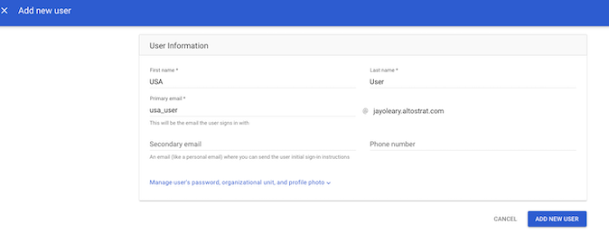
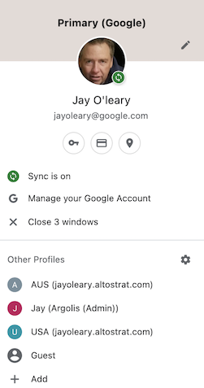
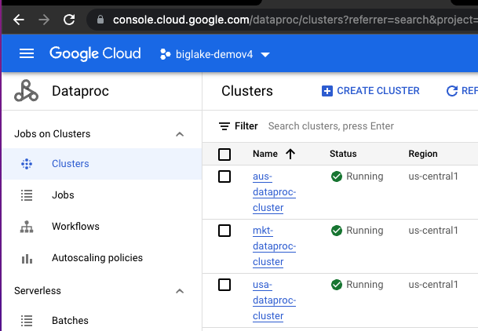
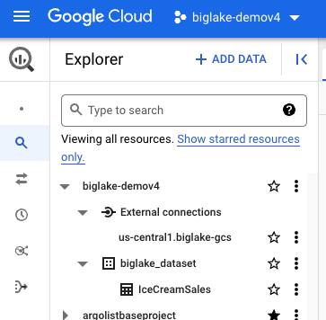
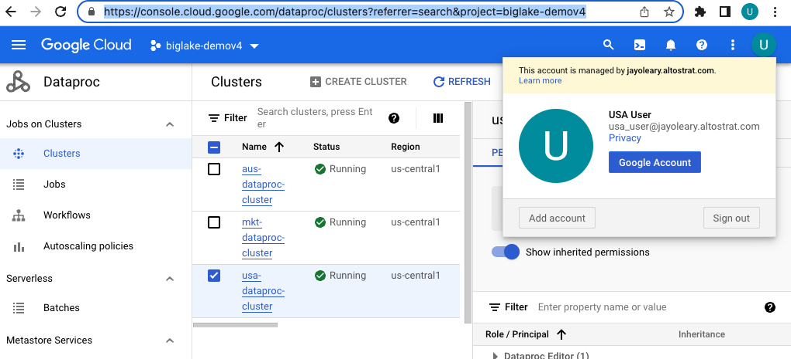
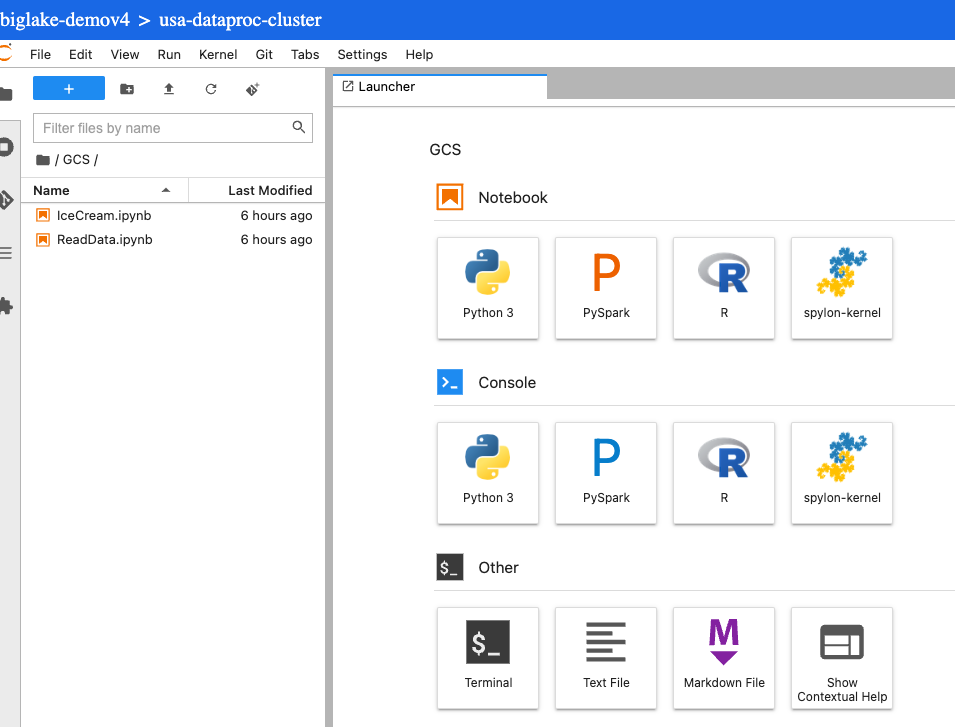
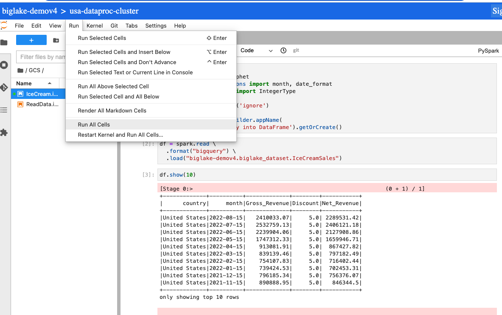
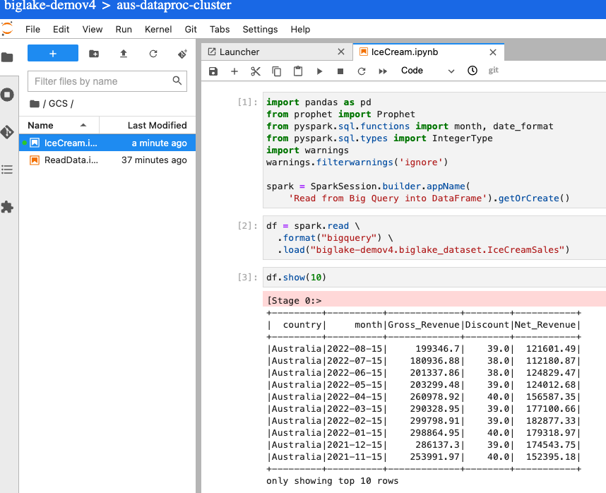

# About<br>
This lab showcases fine-grained access control made possible by BigLake with a minimum viable Spark sample notebook on a Cloud Dataproc cluster. 


# BigLake Finegrained Permissions Lab with Spark on Dataproc

## 1. Prerequisites 

### 1.1. Create a project
Note the project number and project ID. <br>
We will need this for the rest of the lab.

### 1.2. Grant yourself Security Administrator role<br>
This is needed for the networking setup.<br>
Go to Cloud IAM and through the UI, grant yourself security admin role.

### 1.3. Grant yourself Organization Policy Administrator at an Organization level<br>
This is needed to set project level policies<br>
In the UI, set context to organization level (instead of project)<br>
Go to Cloud IAM and through the UI, grant yourself Organization Policy Administrator at an Organization level.<br>
Don't forget to set the project back to the project you created in Step 1 above in the UI.

### 1.4. Create 3 user accounts<br>
Go To admin.google.com...<br>
* Click on 'Add a user'<br>
* And add a user as shown below:<br><br>
 

<br>
- You will add three users: <br>
1. One user with access to all USA records in the dataset <br>
2. One user with access to all Australia records in the dataset<br>
3. One marketing user with access to both USA and Australia recoreds but restricted to certain columns<br>
<br>
- While you can use any usernames you want, we recommend you use the following as we have tested with these: <br>
1. usa_user <br>
2. aus_user <br>
3. mkt_user <br>

<br>

### 1.5. Create Separate Chrome Profiles for the User Accounts
To make it easier to demo the three different personas (users) we recommend you set up 3 profiles in your browser<br>
<br>
- To add a profile<br>
* click on your profile picture at the far right of the screen next to the vertical 3 dots. <br>
* Then click on '+ Add' at the bottom of the screen as shown below: <br>
 
<br>

We recommend you setup three profiles: <br>
1. One for the USA User
2. One for the Australia User
3. And one for the Marketing User

For more information see these instructions --> [Add Profile Instructions](https://support.google.com/chrome/answer/2364824?hl=en)

<hr>

## 2. Details about the environment that is setup by this module

### 2.1. Products/services used in the lab
The following services and resources will be created via Terraform scripts:

1. VPC, Subnetwork and NAT rules
2. IAM groups for USA and Australia
3. IAM permissions for user principals and Google Managed default service accounts
4. GCS buckets, for each user principal and for Dataproc temp bucket
5. Dataplex Policy for Column level Access
6. BigQuery Dataset, Table and Row Level Policies
7. Dataproc 'Personal auth' (kerberized) Clusters: a cluster each for USA, Australia and Marketing Users
8. Pre-created Jupyter Notebooks are uploaded to the GCS 

### 2.2. Tooling

1. Terraform for automation
2. Cloud Shell for executing Terraform

<hr>

## 3. Provision the GCP environment 

This section covers creating the environment via Terraform from Cloud Shell. 
1. Launch cloud shell
2. Clone this git repo
3. Provision foundational resources such as Google APIs and Organization Policies
4. Provision the GCP data Analytics services and their dependencies for the lab

### 3.1. Create a Cloud Shell Session
Instructions for launching and using cloud shell are available [here](https://cloud.google.com/shell/docs/launching-cloud-shell).

### 3.2. Clone the workshop git repo

```
cd ~
git clone https://github.com/j-f-oleary-bigdata/biglake-finegrained-demo
```

### 3.3. About the Terraform scripts

#### 3.3.1. Navigate to the Terraform directory
```
cd ~/biglake-finegrained-demo/
```

#### 3.3.2. Review the Terraform directory structure (& optionally, the content)

Browse and familiarize yourself with the layout and optionally, review the scripts for an understanding of the constructs as well as how dependencies are managed.

#### 3.3.3. What's involved with provisioning with Terraform

1. Define variables for use with Terraform
2. Initialize Terraform
3. Run a Terraform plan & study it
4. Apply the Terraform to create the environment
5. Validate the environment created

### 3.4. Provision the environment

#### 3.4.1. Define variables for use

Modify the below as appropriate for your deployment..e.g. region, zone etc. Be sure to use the right case for GCP region & zone.<br>
Make the corrections as needed below and then cut and paste the text into the Cloud Shell Session. <br>

```
PROJECT_ID=`gcloud config list --format "value(core.project)" 2>/dev/null`
PROJECT_NBR=`gcloud projects describe $PROJECT_ID | grep projectNumber | cut -d':' -f2 |  tr -d "'" | xargs`
PROJECT_NAME=`gcloud projects describe ${PROJECT_ID} | grep name | cut -d':' -f2 | xargs`
GCP_ACCOUNT_NAME=`gcloud auth list --filter=status:ACTIVE --format="value(account)"`
LOCATION="us-central1"
ORG_ID=`gcloud organizations list | grep DISPLAY_NAME | cut -d':' -f2 | xargs`
YOUR_GCP_MULTI_REGION="US"
USA_USERNAME="usa_user"
AUS_USERNAME="aus_user"
MKT_USERNAME="mkt_user"

echo "PROJECT_ID=$PROJECT_ID"
echo "PROJECT_NBR=$PROJECT_NBR"
echo "LOCATION=$LOCATION"
echo "ORG_ID=$ORG_ID"
echo "USA_USERNAME=$USA_USERNAME"
echo "AUS_USERNAME=$AUS_USERNAME"
echo "MKT_USERNAME=$MKT_USERNAME"
```

#### 3.4.2. Provision foundational resources

Foundational resources in this lab constitute Google APIs and Organizational Policies. 

##### 3.4.2.1. Initialize Terraform
The command below needs to run in cloud shell from ~/biglake-finegrained-demo/org_policy

```
cd ~/biglake-finegrained-demo/org_policy
terraform init
```

##### 3.4.2.2. Terraform deploy the resources

The terraform below first enables Google APIs needed for the demo, and then updates organization policies. It needs to run in cloud shell from ~/biglake-finegrained-demo/org_policy. <br>

**Time taken to complete:** <5 minutes

```
terraform apply \
  -var="project_id=${PROJECT_ID}" \
  --auto-approve
```

#### 3.4.3. Provision data analytics services & dependencies

##### 3.4.3.1. Initialize Terraform

Needs to run in cloud shell from ~/biglake-finegrained-demo/demo
```
cd ~/biglake-finegrained-demo/demo
terraform init
```

##### 3.4.3.2. Review the Terraform deployment plan

Needs to run in cloud shell from ~/biglake-finegrained-demo/demo
```
terraform plan \
  -var="project_id=${PROJECT_ID}" \
  -var="project_nbr=${PROJECT_NBR}" \
  -var="org_id=${ORG_ID}" \
  -var="location=${LOCATION}" \
  -var="usa_username=${USA_USERNAME}" \
  -var="aus_username=${AUS_USERNAME}" \
  -var="mkt_username=${MKT_USERNAME}"   
```

##### 3.4.3.3. Terraform provision the data analytics services & dependencies

Needs to run in cloud shell from ~/biglake-finegrained-demo/demo. 
 <br>

**Time taken to complete:** <10 minutes

```
terraform apply \
  -var="project_id=${PROJECT_ID}" \
  -var="project_nbr=${PROJECT_NBR}" \
  -var="org_id=${ORG_ID}" \
  -var="location=${LOCATION}" \
  -var="usa_username=${USA_USERNAME}" \
  -var="aus_username=${AUS_USERNAME}" \
  -var="mkt_username=${MKT_USERNAME}" \
  --auto-approve
```
<hr>

## 4. Validate the Terraform deployment

From your default GCP account (NOT to be confused with the three users we created), go to the Cloud Console, and validate the creation of the following resources-

### 4.1. IAM users
Validate IAM users in the project, by navigating on Cloud Console to -
1. Youself
2. usa_user
3. aus_user
4. mkt_user

### 4.2. IAM groups

1. Group: australia-sales	with email: australia-sales@akhanolkar.altostrat.com with the user usa_user@ in it
2. Group: us-sales	with email: us-sales@akhanolkar.altostrat.com with the user aus_user@ in it	

### 4.3. IAM roles

a) User Principles:<br>
1. usa_user: Viewer, Dataproc Editor
2. aus_user: Viewer and Dataproc Editor
3. mkt_user: Viewer and Dataproc Editor
<br>

b) Google Managed Compute Engine Default Service Account:<br>
4. YOUR_PROJECT_NUMBER-compute@developer.gserviceaccount.com: Dataproc Worker
<br>

c) BigQuery Connection Default Service Account:<br>
Covered below

### 4.4. GCS buckets
1. dataproc-bucket-aus-YOUR_PROJECT_NUMBER
2. dataproc-bucket-mkt-YOUR_PROJECT_NUMBER
3. dataproc-bucket-usa-YOUR_PROJECT_NUMBER
4. dataproc-temp-YOUR_PROJECT_NUMBER

### 4.5. GCS bucket permissions
1. dataproc-bucket-aus-YOUR_PROJECT_NUMBER: Storage Admin to aus_user@
2. dataproc-bucket-mkt-YOUR_PROJECT_NUMBER: Storage Admin to mkt_user@
3. dataproc-bucket-usa-YOUR_PROJECT_NUMBER: Storage Admin to aus_user@
4. dataproc-temp-YOUR_PROJECT_NUMBER: Storage Admin to all three users created

### 4.6. Network resources
Validate the creation of-
1. VPC called default
2. Subnet called default
3. Firewall called subnet-firewall
4. Cloud Router called nat-router
5. Cloud NAT gateway called nat-config

### 4.7. Cloud Dataproc Clusters

From your default login (not as the 3 users created above), go to the cloud console and then the Dataproc UI & validate the creation of the following three Dataproc Clusters: 
1. aus-dataproc-cluster
2. usa-dataproc-cluster
3. mkt-dataproc-cluster
<br><br>
 

### 4.8. Notebook copy to each Dataproc cluster's Dataproc bucket
Each of the three buckets (dataproc-bucket-aus/usa/mkt-YOUR_PROJECT_NUMBER) below should have the following in the exact directory structure:
1. notebooks/jupyter/IceCream.ipynb

### 4.9. Policy Tag Taxonomies
Navigate to Dataplex->Policy Tag Taxonomies and you should see a policy tag called -
1. Business-Critical-YOUR_PROJECT_NUMBER

### 4.10. Policy Tag
Click on the Policy Tag Taxonomy in Dataplex and you should see a Policy Tag called -
1. Financial Data

### 4.11. User association with Policy Tag
Each of the two users usa_user@ & aus_user@ are granted datacatalog.categoryFineGrainedReader tied to the Policy Tag created

### 4.12. BigLake Connection
Navigate to BigQuery in the Cloud Console and you should see, under "External Connections" -
1. An external connection called 'us-central1.biglake.gcs'

### 4.13. BigQuery Dataset
In the BigQuery console, you should see a dataset called-
1. biglake_dataset

### 4.14. IAM role to BigQuery External Connection Default Service Account
bqcx-YOUR_PROJECT_NUMBER@gcp-sa-bigquery-condel.iam.gserviceaccount.com: Storage Object Viewer	

### 4.15. BigLake Table
A BigLake table called IceCreamSales -
1. That uses the Biglake connection 'us-central1.biglake.gcs'
2. With CSV configuration 
3. On CSV file at - gs://dataproc-bucket-aus-YOUR_PROJECT_NUMBER/data/IceCreamSales.csv
4. With a set schema
5. With column 'Discount' tied to the Policy Tag created -'Financial Data'
6. With column 'Net_Revenue' tied to the Policy Tag created -'Financial Data'

 

### 4.16. Row Access Policies
Create Row Access Policies, one for each user - aus_user@ and usa_user@ -
1. Row Access Policy for the BigLake table IceCreamSales called 'Australia_filter' associated with the IAM group australia-sales@ on filter Country="Australia"
2. Row Access Policy for the BigLake table IceCreamSales called 'US_filter' associated with the IAM group us-sales@ on filter Country="United States"

<hr>

## 5. Fine-grained Access Control Lab powered by BigLake

So far, you completed the environment setup and validation. In this sub-module, you will learn the fine grained access control made possible by BigLake.

### 5.1. Principle of Least Privilege: Administrators should not have access to data
In your current default user login, navigate to BigQuery on the Cloud Console. You should see a dataset biglake_dataset and a table called "biglake_dataset.IceCreamSales".
<br>
Run the query below in the BQ query UI-

```
SELECT * FROM `biglake-spark-demo.biglake_dataset.IceCreamSales` LIMIT 1000
```

You should not see any results, infact your should see the following error-
```
Access Denied: BigQuery BigQuery: User has neither fine-grained reader nor masked get permission to get data protected by policy tag "Business-Critical-225879788342 : Financial Data" on columns biglake-spark-demo.biglake_dataset.IceCreamSales.Discount, biglake-spark-demo.biglake_dataset.IceCreamSales.Net_Revenue.
```

This is a demonstration of applying **principle of least privilege** - administrators should not have access to data with in the IceCreamSales table.

### 5.2. Principle of Least Privilege: USA country based restricted row and column access
This section demonstrates how you can use BigLake to restrict access based on policies. <br>
1. Row Level Security: "usa_user" can only access data for (Country=)United States in the IceCreamSales table 
2. Column Level Security: "usa_user" can see the columns Discount and Net_Revenue 

**What to expect:**
1. You will log on as the usa_user in an incognito browser
2. First, you will launch Cloud Shell in the Cloud Console and create a personal authentication session that you will keep running for the duration of this lab section
3. Next, you will go to the Dataproc UI on the Cloud Console, go to "WEB INTERFACES" and launch JupyterLab
4. In JupyterLab, you will first launch a terminal session and authenticate yourself and get a Kerberos ticket by running 'kinit'
5. Then you will run through the notebook


#### 5.2.1. Switch to the "usa_user" profile

Switch profiles to the usa_user account in your Chrome browser. Make sure to select the project you created in the step above.  In this example, the project is 'biglake-demov4' as shown below:



#### 5.2.2. Create a personal authentication session...

1. Go to console.cloud.google.com
2. Launch cloud shell
3. Paste the below to create a personal authentication session

```
PROJECT_ID=`gcloud config list --format "value(core.project)" 2>/dev/null`
USER_PREFIX="usa"
gcloud dataproc clusters enable-personal-auth-session \
    --project=${PROJECT_ID} \
    --region=us-central1 \
    --access-boundary=<(echo -n "{}") \
   ${USER_PREFIX}-dataproc-cluster
```

4. You will be prompted with the below; Respond with a 'Y', followed by enter
```
A personal authentication session will propagate your personal credentials to the cluster, so make sure you trust the cluster and the user who created it.

Do you want to continue (Y/n)?
```

5. You will see the following text
```
Injecting initial credentials into the cluster usa-dataproc-cluster...done.     
Periodically refreshing credentials for cluster usa-dataproc-cluster. This will continue running until the command is interrupted...working.  
```

6. **LEAVE** this Cloud Shell **RUNNING** while you complete the next steps, **DO NOT SHUT DOWN**

#### 5.2.3. Initiate the kerberos session on the Personal Auth Dataproc Cluster...

Still signed in as the USA user, in a separate tab in the same browser window, navigate to the cloud console (console.cloud.google.com) and then the Dataproc UI:

1. Click on the usa-dataproc-cluster link 
<br>

2. Then click on the 'WEB INTERFACES' link 
<br>

3. Scroll to the bottom of the page and you should see a link for 'Jupyter Lab' 
<br>

4. Click on the 'JupyterLab' link (not to be confused with Jupyter) and this should bring up a new tab as shown below: <br>

<br>

5. In Jupyter, Click on "File"->New Launcher and then ->Terminal (at bottom of screen under 'Other' 
<br>

6. In terminal screen, we will authenticate, by running kinit; Copy-paste the below into the terminal window: 
<br>

```
kinit -kt /etc/security/keytab/dataproc.service.keytab dataproc/$(hostname -f)
```

<br>

7. Next validate the creation of the Kerberos ticket by running the below command-

```
klist
```

Author's output-

```
Ticket cache: FILE:/tmp/krb5cc_1001
Default principal: dataproc/gdpsc-usa-dataproc-cluster-m.us-central1-a.c.biglake-dataproc-spark-lab.internal@US-CENTRAL1-A.C.BIGLAKE-DATAPROC-SPARK-LAB.INTERNAL

Valid starting     Expires            Service principal
10/18/22 14:44:05  10/19/22 00:44:05  krbtgt/US-CENTRAL1-A.C.BIGLAKE-DATAPROC-SPARK-LAB.INTERNAL@US-CENTRAL1-A.C.BIGLAKE-DATAPROC-SPARK-LAB.INTERNAL
        renew until 10/25/22 14:44:05
```
<br>
8. You can then close the the terminal screen.

#### 5.2.4. Run the 'IceCream.ipynb' Notebook...

**About the notebook:** <br>
This notebook demonstrates finegrained BigLake powered permissions, with a Icecream Sales Forecasting forecasting, with PySpark for preprocessing and Python with Prophet for forecasting, with the source data in a BigLake table. <br>

1. From the Jupyter Lab tab you created above, double click on the 'IceCream.ipynb' file as shown below...<br>

2. Then click on the icon on the right that says 'Python 3' with a circle next to it...

3. A dialog box that says 'Select Kernel' will appear, choose 'PySpark' and hit select

<br>

4. You can now run all cells.  
* From the 'Run->Run all Cells' menu.   <br>
* Below cell 13, you should see data only for the 'United States' as shown below:

<br><br>

This concludes the exercise of row and column level security powered by Biglake. Lets repeat the same with the user aus_user@


### 5.3. Principle of Least Privilege: Australia country based restricted row and column access
This section demonstrates how you can use BigLake to restrict access based on policies. <br>
1. Row Level Security: "aus_user" can only access data for (Country=)Australia in the IceCreamSales table 
2. Column Level Security: "aus_user" can see the columns Discount and Net_Revenue 

Follow steps 5.2.1 through 5.2.4 from above, abbreviated for your convenienc-<br>
1. Login to an incognito browser as aus_user
2. Use the command below to start a personal auth session in gcloud<br>
```
PROJECT_ID=`gcloud config list --format "value(core.project)" 2>/dev/null`
USER_PREFIX="aus"
gcloud dataproc clusters enable-personal-auth-session \
    --project=${PROJECT_ID} \
    --region=us-central1 \
    --access-boundary=<(echo -n "{}") \
   ${USER_PREFIX}-dataproc-cluster
```
3. Log into the aus-dataproc-cluster cluster, and go to "WEB INTERFACES" and click on JupyterLab
4. In JupyterLab, open terminal and run kinit to authenticate and get a ticket
```
kinit -kt /etc/security/keytab/dataproc.service.keytab dataproc/$(hostname -f)
```

5. The major difference is that in cell 12, you should see data only for the 'Australia' as shown below:

<br>

<hr>

### 5.4. Principle of Least Privilege: Restricted column access for the marketing user (no access to financial data)
This section demonstrates how you can use BigLake to restrict access based on policies. <br>
1. Row Level Security: mkt_user@ can access data for any country in the IceCreamSales table (unlike aus_user@ and usa_user@ that could see data only for their country)
2. Column Level Security: mkt_user@ can see all the columns except sensitive data columns Discount and Net_Revenue for which the user does not have permissions

Follow steps 5.2.1 through 5.2.4 from above, abbreviated for your convenienc-<br>
1. Login to an incognito browser as mkt_user
2. Use the command below to start a personal auth session in gcloud<br>
```
PROJECT_ID=`gcloud config list --format "value(core.project)" 2>/dev/null`
USER_PREFIX="mkt"
gcloud dataproc clusters enable-personal-auth-session \
    --project=${PROJECT_ID} \
    --region=us-central1 \
    --access-boundary=<(echo -n "{}") \
   ${USER_PREFIX}-dataproc-cluster
```
3. Log into the mkt-dataproc-cluster cluster, and go to "WEB INTERFACES" and click on JupyterLab
4. In JupyterLab, open terminal and run kinit to authenticate and get a ticket
```
kinit -kt /etc/security/keytab/dataproc.service.keytab dataproc/$(hostname -f)
```

5.  Cell 6 will throw an error, because mkt_user does not have access to all the columns -> specifically does not have access to Discount and Net_Revenue. <br>
Edit cell 5 as follows and run the rest of the cells. They shoudl execute file.
```
rawDF = spark.read \
  .format("bigquery") \
  .load(f"{PROJECT_NAME}.biglake_dataset.IceCreamSales") \
  .select("Month", "Country", "Gross_Revenue")
```

To run the rest of the notebook from cell 5, go to the menu and click on "Run"->"Run Selected Cell And All Below" 

6. **What's different is-**
mkt_user@
- Cannot see discount and net_revenue
- Can see data for both australia and united states

This concludes the validation of column level security with BigLake for the user, mkt_user@.

<hr>


### 6. To destroy the deployment

Congratulations on completing the lab!<br>

You can (a) shutdown the project altogether in GCP Cloud Console or (b) use Terraform to destroy. Use (b) at your own risk as its a little glitchy while (a) is guaranteed to stop the billing meter pronto.
<br>
Needs to run in cloud shell from ~/biglake-finegrained-demo/demo
```
cd ~/biglake-finegrained-demo/demo
terraform destroy \
  -var="project_id=${PROJECT_ID}" \
  -var="project_nbr=${PROJECT_NBR}" \
  -var="org_id=${ORG_ID}" \
  -var="location=${LOCATION}" \
  -var="usa_username=${USA_USERNAME}" \
  -var="aus_username=${AUS_USERNAME}" \
  -var="mkt_username=${MKT_USERNAME}" \
  --auto-approve
 ```

